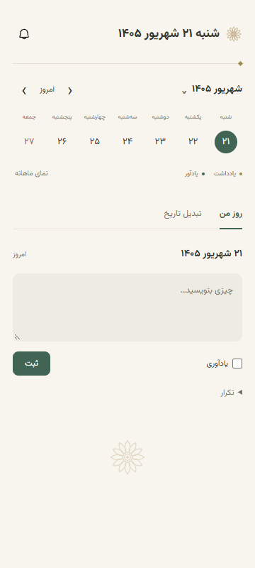

# روز · تقویم شمسی

نسخهٔ ۱.۴.۳ — افزونهٔ سایدپنل کروم برای تقویم شمسی، یادداشت و یادآور؛ کاملاً محلی و بدون نیاز به حساب کاربری.



طرح روشن با رنگ سنگ، سبز سنگی و گل دوازده‌پر الهام‌گرفته از نقش‌های ایران باستان.

## نصب دستی در کروم

1. از بالای همین ریپو، **Code → Download ZIP** را بزنید.
2. فایل ZIP را از حالت فشرده خارج کنید و پوشه را در یک مسیر ثابت نگه دارید.
3. در کروم، آدرس `chrome://extensions` را باز کنید.
4. گزینهٔ **Developer mode** را فعال کنید.
5. روی **Load unpacked** بزنید و پوشه‌ای را انتخاب کنید که فایل `manifest.json` مستقیماً داخل آن است؛ معمولاً `day-calendar-main`.
6. از منوی افزونه‌های کروم، افزونهٔ «روز» را پین کنید و روی آیکن آن بزنید تا سایدپنل باز شود.

حداقل نسخهٔ کروم ۱۱۶ است. برای نصب و استفاده نیازی به Node.js، اجرای `npm install` یا ساخت پروژه ندارید. پوشهٔ افزونه باید پس از نصب هم در همان مسیر باقی بماند.

## به‌روزرسانی دستی

نسخهٔ جدید را دانلود و استخراج کنید، فایل‌ها را در **همان پوشهٔ نصب قبلی** جایگزین کنید و در `chrome://extensions` دکمهٔ **Reload** افزونه را بزنید. افزونه را حذف نکنید تا یادداشت‌ها و یادآورها حفظ شوند.

## امکانات

- تاریخ شمسی واقعی با نام کامل روز، فونت وزیرمتن و محاسبه به وقت تهران.
- نمای هفتگی و ماهانه و تبدیل دوطرفهٔ شمسی/میلادی؛ بازهٔ شمسی ۱۲۰۰ تا ۱۶۰۰.
- چند یادداشت مستقل برای هر روز، ویرایش و حذف جداگانه، ساعت ثبت اولیه.
- یادآور با ساعت تهران و اعلان کروم؛ ساعت ثبت از زمان اعلان جداست.
- محتوا حداکثر ۳۶۰ پیکسل عرض دارد. عرض قاب سایدپنل را خود کروم کنترل می‌کند؛ با کشیدن لبه می‌توانید آن را کوچک کنید.

متن را در فرم مشترک بنویسید و «ثبت» را بزنید. اگر اعلان می‌خواهید، «یادآوری» را فعال و ساعت را انتخاب کنید. هر مورد از همان فهرست قابل ویرایش است و می‌توانید یادآوری آن را روشن یا خاموش کنید. پیش‌نویس هنگام جابه‌جایی روزها تا باز بودن صفحه حفظ می‌شود؛ برای نگهداری پس از بستن، حتماً ذخیره کنید. ساعت ثبت با ویرایش تغییر نمی‌کند. یادداشت‌های قدیمی که زمان ثبت ندارند، بدون ساعت نمایش داده می‌شوند.

## ذخیره‌سازی

همهٔ یادداشت‌ها و یادآورها فقط در `chrome.storage.local` همین پروفایل مرورگر ذخیره می‌شوند. اتصال، ورود گوگل، مجوز شبکه و پشتیبان‌گیری ابری حذف شده‌اند. به‌روزرسانی فقط تنظیمات و تایمر قابلیت ابری سابق را پاک می‌کند و داده‌های کاربران را نگه می‌دارد.

با حذف خود افزونه یا پروفایل مرورگر، داده‌های محلی حذف می‌شوند و بازیابی ابری وجود ندارد. برای به‌روزرسانی از Reload استفاده کنید.

## تاریخ و اعلان

تاریخ با `Intl.DateTimeFormat`، تقویم `persian` و منطقهٔ `Asia/Tehran` محاسبه می‌شود؛ ساعت دستگاه باید درست باشد. تاریخ ۱۲ سپتامبر ۲۰۲۶ با time.ir تطبیق داده شد: شنبه ۲۱ شهریور ۱۴۰5. از API آن استفاده نمی‌شود. تعطیلات رسمی و مناسبت‌ها در این نسخه وجود ندارند.

برای اعلان به‌موقع، کروم باید در حال اجرا و اعلان‌های آن در سیستم مجاز باشد. یادآورهای عقب‌افتاده پس از فعال شدن دوبارهٔ سرویس بررسی می‌شوند. حالت خواب یا مزاحم نشوید می‌تواند نمایش اعلان را به تأخیر بیندازد. «اعلان ارسال شد» به معنای پذیرفته شدن درخواست توسط API است.

## توسعه و آزمون

```sh
npm ci
npm test
npx playwright install chromium
node tests/browser.mjs
node tests/font-inspect.mjs
```

فایل‌های افزونه بدون مرحلهٔ build اجرا می‌شوند. اسکریپت `scripts/package-release.ps1` بستهٔ ZIP را می‌سازد.

فونت [Vazirmatn](https://github.com/rastikerdar/vazirmatn) با مجوز OFL در assets/OFL.txt و آیکن زنگ [Phosphor](https://github.com/phosphor-icons/core) با مجوز MIT در assets/PHOSPHOR-LICENSE قرار دارند.

## تکرار یادداشت و یادآور

در بخش «تکرار»، هر روز یا روزهای مشخص هفته را انتخاب کنید. پایان می‌تواند پس از ۷، ۳۰، ۹۰ روز، تعداد روز دلخواه یا بدون پایان باشد. تعداد روز، طول بازه با احتساب روز شروع است؛ در تکرار هفتگی فقط روزهای انتخاب‌شده در این بازه ثبت می‌شوند.

ویرایش و حذف برای «فقط این روز» یا «همه تکرارها» قابل انجام است. ویرایش همه از شروع اصلی اعمال می‌شود و استثناهای قبلی را بازنشانی می‌کند. تکرارهای بی‌پایان به شکل قانون ذخیره می‌شوند؛ فهرست پیش‌رو تا ۳۰ نوبت آیندهٔ هر مجموعه را نشان می‌دهد و تقویم روز انتخاب‌شده را محاسبه می‌کند.

اعلان با بسته بودن پنل نیز از سرویس پس‌زمینه ارسال می‌شود؛ خود کروم باید اجرا باشد. پس از بازگشت کروم، یک نوبت عقب‌افتادهٔ هر مجموعه ارسال و نوبت آینده زمان‌بندی می‌شود. آزمون اختصاصی: `node tests/recurrence-browser.mjs`.
